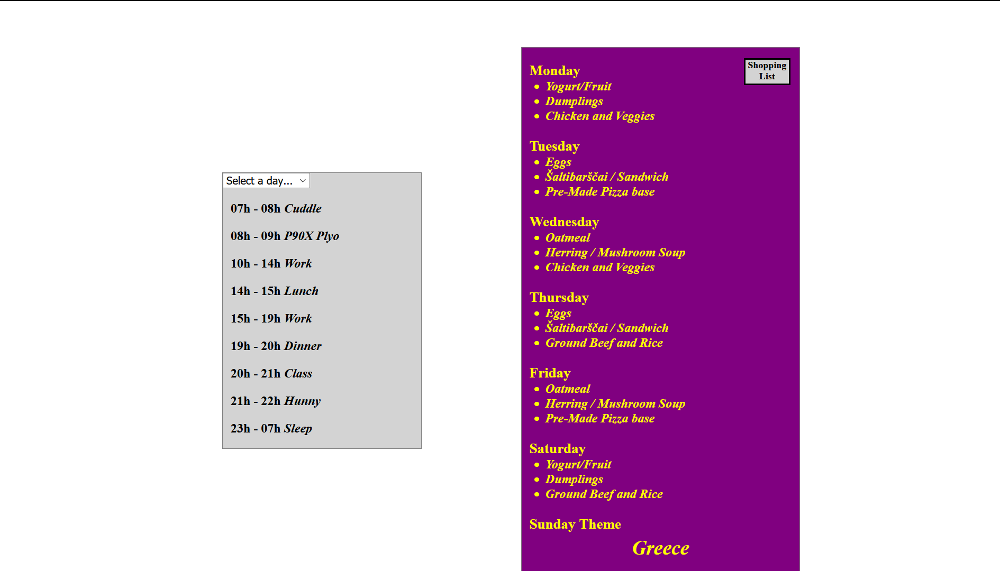

# Project Name

Brandon's Food and Exercise Scheduler

Additional description about the project and its features.

This is a personal project used to test newly learned code features as well as to keep me organized each week

## Built With

- HTML, CSS, and JS
- Atom
- Windows10 and Ubuntu

## Live Demo

[Live Demo Link](https://rawcdn.githack.com/defoebrand/schedule/2a00e04929ffb271a255696e727d6630e2377803/index.html)

## Getting Started

To get your own copy of our project clone the repository to your local machine.

## Authors

👤 **Brandon Defoe**

- Github: [@defoebrand](https://github.com/defoebrand)
- Gmail: defoe.brand@gmail.com

## 🤝 Contributing

Contributions, issues and feature requests are welcome!

Feel free to check the [issues page](issues/).

## Show your support

Give a ⭐️ if you like this project!

## Future Features
- Weekly menu generator
- Autofill of the shopping list

## 📝 License

This project is unlicensed
